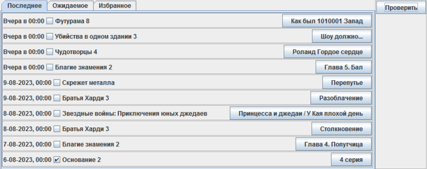
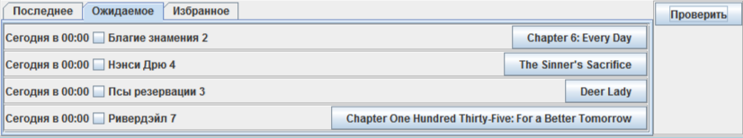
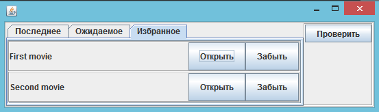

# Movie Checker
The application allows you to check for new episodes without visiting a website.  
[Project issues](https://github.com/users/unkus/projects/1)

## 1. Goals
The goal of the project is to gain experience with the next stack:
- Gradle
- Java 17 (1.8++)
- Spring (Spring Boot, Spring Data JPA)
- H2 database
- Jupiter (JUnit5)

## 2. Modules
Project has core, database, datasource and some number modules provides data.

### 2.1 Core
Core module include DI submodule describes used objects.
Also here placed UI part (possibly will be extracted to separate module).Provides a couple of views representing data received from a provider. Provides the ability to open episodes in the default system browser and mark movies as favorites.

### 2.2 Database
The data is distributed across tables: site, movie, season, episode and favorite.
one-to-many relations: site->movie->season->episode 
one-to-one relations: 
- favorite->movie 
- favorite->episode - keeping last viewed episode

### 2.3 Datasource
The idea is to provide an interface and basic functionality for data providers developed as a separate library.
Common functions allowing to a data provider to concentrate on getting data.
- Receiving data request and calling implemented interface.
- Sends data received event when data provider prepares it.
- Store data in database.
- Sends data error event in case of error during data retrieving.

### 2.4 Lostfilm
Demonstrates how data can be retrieved from web site and transferred to the library.
