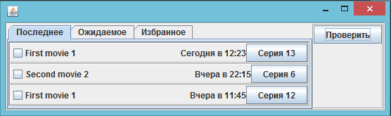

# Movie Checker
The application allows you to check for new episodes without visiting a website.  
[Project issues](https://github.com/users/unkus/projects/1)

## 1. Goals
The goal of the project is to gain experience with the next stack:
- Gradle
- Java 17 (1.8++)
- Spring (Spring Boot, Spring Data JPA)
- H2 database
- Jupiter (JUnit5)

## 2. Modules
Project include two main modules and one demonstration module.
There is also one external module that should provide data.

### 2.1 Library
The library project describes tables in database and basic functions for provider.

#### 2.1.1 Database
The data is distributed across tables: site, movie, season, episode and favorite.
All tables from "site" to "episode" have one-to-many relationship, except "favorite".
Table "favorite" has one-to-one relationship with movie and episode (last viewed episode).

#### 2.1.2 Basic Provider Functions
The following functions allow a provider to concentrate on getting data.
- Handles data request from GUI calling retrieveData method implemented in an external provider.
- Sends data received event when data will be received.
- Sends data error event in case of an exception from an external provider.
- Transfer data provided in DataRecord to database entities.

### 2.2 GUI Application
The app project provides a couple of views representing data received from a provider.  
Provides the ability to open episodes in the default system browser and mark movies as favorites.

### 2.3 Demo Provider
Demonstrates how data can be extracted and transferred to the library.  
The data.html file is used as source for data. 
